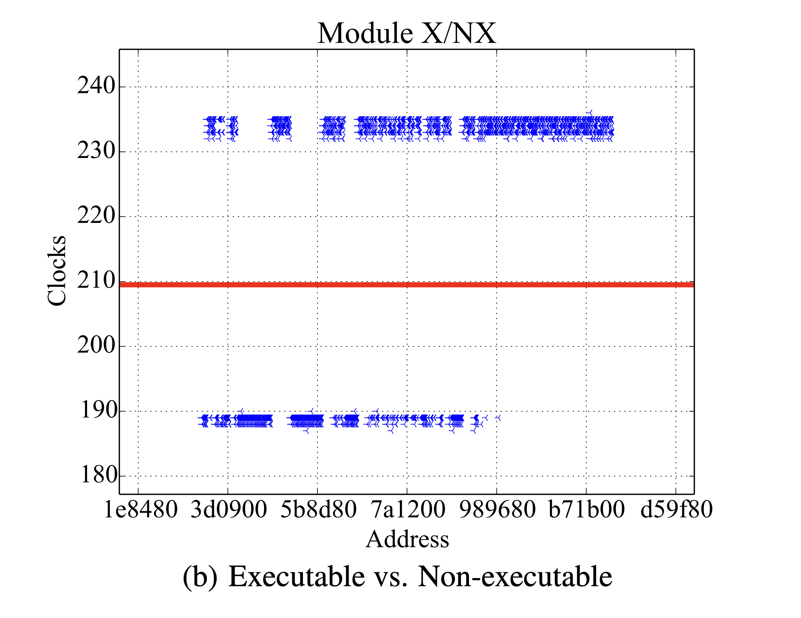

# Kernel Address Space Layout Randomization

==Jannik Wibker==

---

<!-- footer: What are ASLR and KASLR -->

## What is (K)ASLR?

**ASLR** stands for **Address Space Layout Randomization**

**KASLR** stands for **Kernel Address Space Layout Randomization**

---

## What is ASLR?

What is contained in the address space of a process?
- the executable: `.text`, `.data`, `.bss`, `.rodata`, etc.
- dynamically linked libraries
- allocated pages (could be many)
- the stack(s)
- *the kernel address space*

ASLR randomizes these locations (excluding the kernel address space).

---

## What is KASLR?

Kernel address space is mapped into every process
- Reduces overhead when doing syscalls (flushing TLB, etc.)

Cannot be read (or written to) from user space, but:
- There might be arbitrary read / write exploits
- Could build ROP chains in the kernel stack with gadgets from the kernel

---

## What is KASLR?

**Possible solution**: Randomize the kernel address space as well.

Without knowing the layout of the kernel address space, it is much harder to exploit:

- Would have to find the kernel stack first.
- Would have to find addresses of useful kernel code first (similar to user space code with ASLR).

---

## Timeline of (K)ASLR Implementations


---

<!-- _paginate: hold -->

## Timeline of (K)ASLR Implementations


<!-- Windows Vista's implementation wasn't all too great, it got greatly improved in later versions -->
<!-- Windows 10 did quite a few improvements once again (Windows 10 1607 split up kernel and module address ranges for KASLR) -->

---

<!-- _paginate: hold -->

## Timeline of (K)ASLR Implementations


---

<!-- _paginate: hold -->


## Timeline of (K)ASLR Implementations


---

<!-- footer: Implementation Differences -->

## Implementation Differences between OSes

- Entropy
- Address ranges

---

<!-- _paginate: hold -->

## Implementation Differences between OSes

- Entropy
- Address ranges
- Separation of kernel and modules
  - Windows and Linux separate them; macOS does not

---

<!-- _paginate: hold -->

## Implementation Differences between OSes

- Entropy
- Address ranges
- Separation of kernel and modules
  - Windows and Linux separate them; macOS does not
- Rules which are followed while allocating
  - Empty pages in between modules (Linux does this)
  - Further randomization inside of a page (Windows does this)
  - Inherent ordering of the kernel and/or modules

<!-- Linux having empty pages in-between is something that DrK exploits; using this DrK can differentiate modules from each other and doesn't recognize them as just one "big blob of pages" -->

---

## Entropy provided by KASLR

| OS      | Kernel/Modules  | Entropy     | Alignment Size |
| ------- | --------------- | ----------- | ---------- |
| Linux   | Kernel          | 6 bits      | 16MB       |
|         | Modules         | 10 bits     | 4KB        |
| Windows | Kernel          | 13 bits     | 2MB        |
|         | Modules         | 13 bits     | 2MB        |
| macOS   | Kernel          | 8 bits      | 2MB        |

> Subject to change with each kernel/OS release, data from 2016.

<!-- These numbers are partially out of date, apparently the alignment size for linux/kernel changed to 2MB resulting in 9 bits of entropy, other change may also have occured -->
<!-- These numbers are kind of hard to come by; they change quite often, sources state different numbers; address ranges and alignment sizes don't match the given entropy, etc. -->
<!-- No two pages can share the same address, this means that the given entropy is only true for the first page being allocated -->
<!-- If specific alignment rules (A must come before B) are in place the entropy for B is greatly dependant on A -->

---

## Attacks against KASLR

Multiple attacks against KASLR have been published.

They all try to gather information about the memory layout of the kernel. (If possible) pages get categorized into:
- kernel code
- data structures
- drivers / modules

<!-- syscall trampoline, PCB/TCB, filesystem caches, page tables, etc. -->

---

<!-- footer: Attacks against KASLR -->

## Attacks against KASLR

- Done by checking if a specific address is mapped or not.
- Some exploits can check for executable pages.
- Seldom exploits can read actual data.

All of those need some sort of explicit exploit as this isn't normally possible from user space.

<!-- Spectre and Meltdown are examples of exploits which can read actual data -->
<!-- There have been quite a few attacks all with roughly the same fundamental idea -->
<!-- Trigger a read somewhere you're not supposed to, get this value to be cached somewhere without proper cleanup, check if value has been cached or not (if not cached then not mapped, etc.) -->
<!-- sometimes TSX based, sometimes SGX based (Software Guard Extension; think like a "secure enclave") -->

---

## Attacks against KASLR - DrK

One of those is called **DrK**.

Based on **TSX** (*Intel Transactional Synchronization Extension*)
- Offers transactions which are similar in concept to database transactions

<br />
<br />
<span style="font-size: 28px">

> DrK: "Breaking Kernel Address Space Layout Randomization with Intel TSX" (2016) by Yeongjin Jang, Sangho Lee, and Taesoo Kim.

</span>

<!-- most likely stands for DeRandomize Kernel -->

---

## Attacks against KASLR - TSX

```c
// start transaction, if rolled back execution continues from here
// but with a different return value (status code of transaction)
if (_xbegin() == _XBEGIN_STARTED) {

  ... // do work

  _xend();        // commit transaction
  _xabort(status) // or abort with status code (=> rollback)
} else {
  // abort handler
}
```

---

## Attacks against KASLR - DrK

DrK abuses that exceptions are treated differently in TSX than otherwise.

If an exception (e.g. **page fault**, **access violation**) occurs, the transaction is aborted and rolled back, but the **kernel is not notified**.

<!-- abort handler is immediately called without notifying the OS, the OS also isn't notified later on; it basically never notices that the exceptions took place -->

---

## Attacks against KASLR - DrK

**Idea**:
Page faults and access violations take different amounts of time depending on the status of the page

Measure the clock cycles for memory accesses and infer whether it is:
- mapped / unmapped
- executable / not executable

<!-- First check for mapped and unmapped -->
<!-- Then for the mapped pages repeat and check for X/NX -->
<!-- Might have to do this repeatedly to get the most accurate results though -->

---

## Attacks against KASLR - DrK

```c
uint64_t do_probe_memory(void* addr) {
  uint64_t beg = rdtsc_beg();               // start timer

  if (_xbegin() == _XBEGIN_STARTED) {
                                            // generates access violation
    asm volatile("mov rax, [addr]");        // mapped vs unmapped
  } else {
    return rdtsc_end() - beg;               // compute time difference
  }
}
```

<!-- mapped vs unmapped check -->
<!-- source code simplified but the actual code isn't all too complicated either, can be found on github -->

---

<!-- _paginate: hold -->

## Attacks against KASLR - DrK

```c
uint64_t do_probe_memory(void* addr) {
  uint64_t beg = rdtsc_beg();               // start timer

  if (_xbegin() == _XBEGIN_STARTED) {
                                            // generates access violation
    asm volatile("mov rax, addr; jmp rax"); // executable vs non-executable
  } else {
    return rdtsc_end() - beg;               // compute time difference
  }
}
```

<!-- executable vs non-executable check -->

---

## Attacks against KASLR - DrK




<br />
<br />
<br />
<br />
<br />
<br />
<br />
<br />

<span style="font-size: 28px">

**Source**: "Breaking Kernel Address Space Layout Randomization with Intel TSX" (2016) by Jang et al., Page 5, Figure 6

</span>

<!-- The lines in each figure represent the thresholds using which categorization happens -->

---

<!-- footer: Mitigations -->

## KAISER / KPTI

- **K**ernel **P**age **T**able **I**solation, previously known as KAISER
- Introduced in Linux 4.15
- Mitigates DrK and a few similar attacks
- Mitigates meltdown (was published **before** meltdown)
- Performance impacts ranging from 0.28% to ~20%,
  **roughly 5%** for most workloads

<!-- The higher performance impacts are coming mostly from databases (postgres, redis); compiling the linux kernel also takes a 5% hit on haswell -->

---

## KAISER / KPTI

- Reduce kernel address space mapped in user space
- Only include absolutely necessary pages needed for syscalls
- No page table entries
  $\implies$ no timing attacks

<!-- All exploits rely on entries being present in the page table and cache invalidation not being perfect after a read has already occured -->
<!-- If these entries didn't exist outright they can't be exploited -->
<!-- KPTI lowers the attack surface greatly by making the address space way slimmer -->
<!-- Windows and macOS had similar fixed -->


---

<!--
footer: ""
paginate: false
-->

# Overview

**Thanks for your attention!** - **Do you have any questions?**

Here's a quick run down of what was covered:
- What are ASLR and KASLR?
- OS Implementation Differences
- DrK: a TSX-based attack
- KPTI: a mitigation for DrK and similar attacks

<!-- Could mention FGKASLR and re-randomizing the kernel address space if it comes up naturally -->
<!-- Also consider talking about randomizing the base address of the kernel inside of the mapped region (Windows 10 does this) -->
