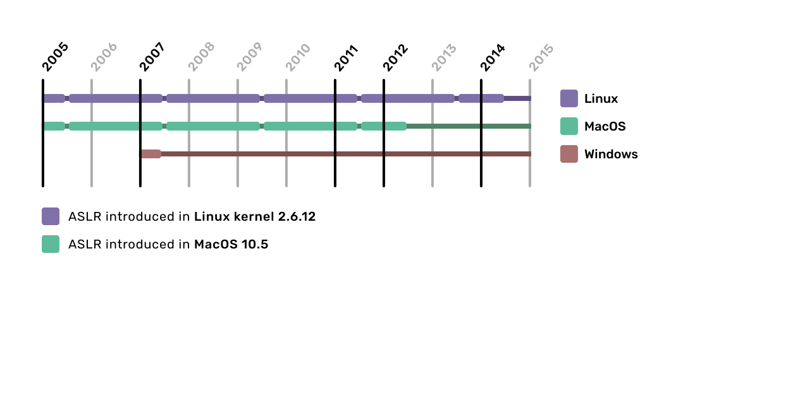
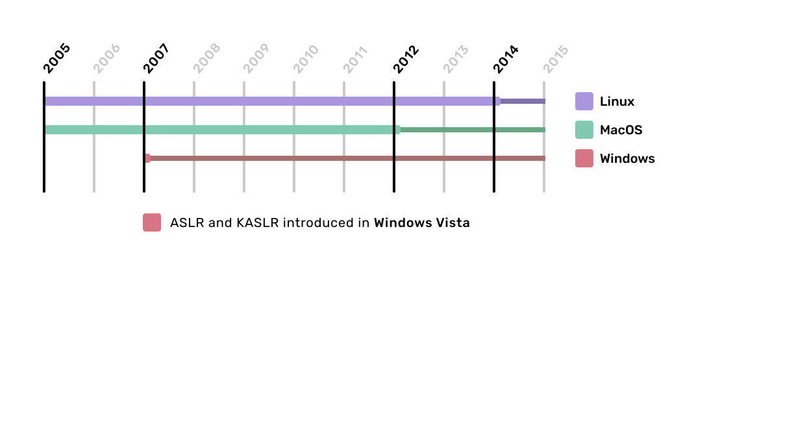
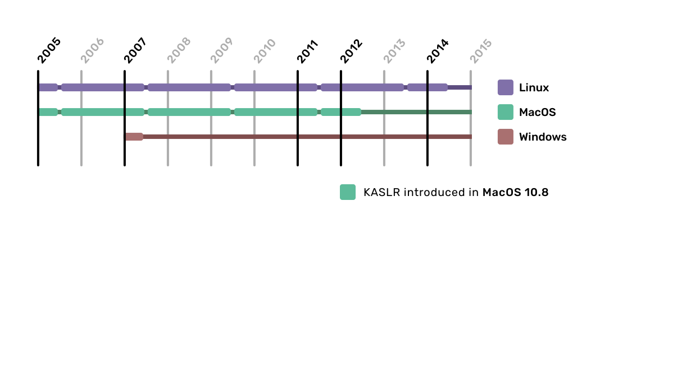
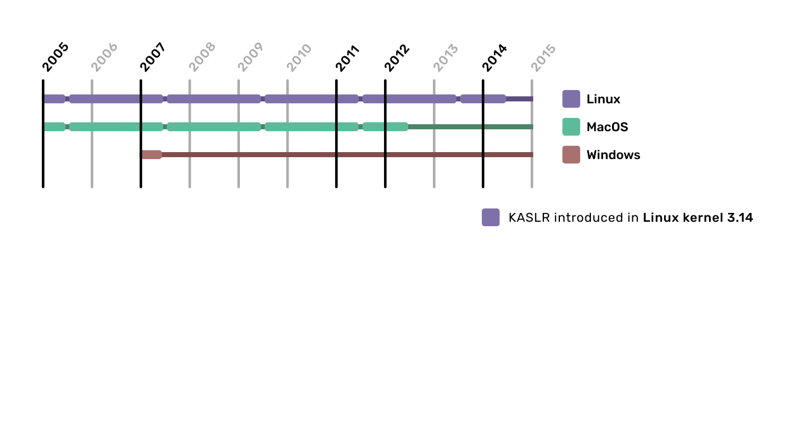
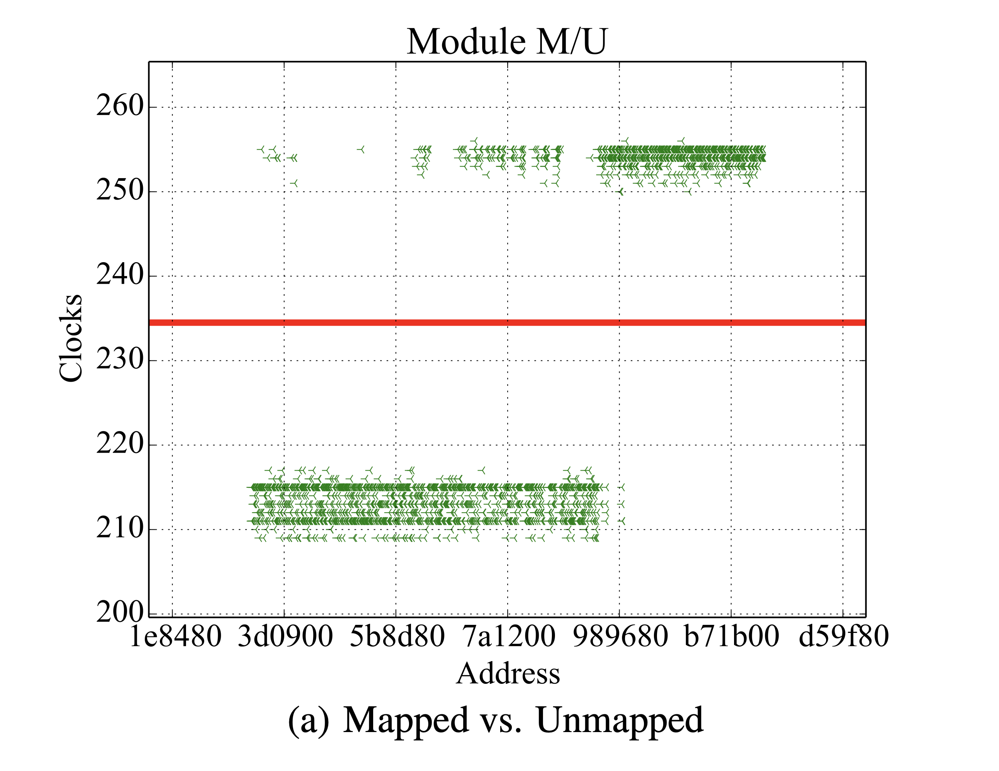
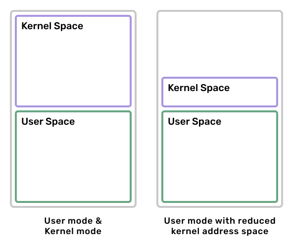

# Kernel Address Space Layout Randomization

==Jannik Wibker==

---

## What is (K)ASLR?

**ASLR** stands for **Address Space Layout Randomization**

**KASLR** stands for **Kernel Address Space Layout Randomization**

---

## What is ASLR?

What is contained in the address space of a process?
- the executable: `.text`, `.data`, `.bss`, `.rodata`, etc.
- dynamically linked libraries
- allocated pages (could be many)
- the stack
- *the kernel address space*

---

## What is ASLR?

With ASLR the locations of all these things (excluding the kernel address space) are randomized.

---

## What is KASLR?

Kernel address space is mapped into every process
(reduces overhead when doing syscalls (flushing TLB, etc.))

Cannot be read (or written to) from user space, but:
- There might be arbitrary read / write exploits
- Parts of the kernel address space are marked executable

---

## What is KASLR?

**Possible solution**: Randomize the kernel address space as well.

Without knowing the layout of the kernel address space, it is much harder to exploit.

---

## Timeline of (K)ASLR Implementations




---

## Timeline of (K)ASLR Implementations




---

## Timeline of (K)ASLR Implementations




---

## Timeline of (K)ASLR Implementations




---

## Implementation Differences between OSes

- Entropy
- Address ranges

---

## Implementation Differences between OSes

- Entropy
- Address ranges
- Separation of kernel and modules
  - Windows and Linux separate them; MacOS does not

---

## Implementation Differences between OSes

- Entropy
- Address ranges
- Separation of kernel and modules
  - Windows and Linux separate them; MacOS does not
- Rules which are followed while allocating
  - Empty pages in between modules (Linux does this)
  - Further randomization inside of a page (Windows does this)
  - Inherent ordering of the kernel and/or modules

---

## Entropy provided by KASLR

| OS      | Kernel/Modules  | Entropy     | Align Size |
| ------- | --------------- | ----------- | ---------- |
| Linux   | Kernel          | 9 bits      | 2MB        |
|         | Modules         | **TODO**    | 4KB        |
| Windows | Kernel          | 13 bits     | 2MB        |
|         | Modules         | **TODO**    | **TODO**   |
| macOS   | Kernel          | 8 bits      | 2MB        |

> This is subject to change with each kernel/OS release

---

## Attacks against KASLR

Multiple attacks against KASLR have been published.

They all try to gather information about the memory layout of the kernel. (If possible) pages get categorized into:
- kernel code
- data structures
- drivers / modules

---

## Attacks against KASLR

- Done by checking if a specific address is mapped or not.
- Some exploits can check for executable pages.
- Seldom exploits can read actual data.

All of those need some sort of explicit exploit as this isn't normally possible from user space.

---

## Attacks against KASLR - DrK

One of those is called **DrK**.

Based on **TSX** (*Intel Transactional Synchronization Extension*)


---

## Attacks against KASLR - TSX

Similar concept to database transactions.

```
* start transaction
* do work (or abort)
* commit transaction
```

If `do work` fails, everything done prior in the transaction is rolled back.

---

## Attacks against KASLR - TSX

```c
// start transaction, if rolled back execution continues from here
// but with a different return value (status code of transaction)
if (_xbegin() == _XBEGIN_STARTED) {

  ... // do work

  _xend();        // commit transaction
  _xabort(status) // or abort with status code
} else {
  // abort handler
}
```

---

## Attacks against KASLR - DrK

DrK abuses that exceptions are treated differently in TSX than otherwise.

If an exception (e.g. **page fault**, **access violation**) occurs, the transaction is aborted and rolled back, but the **kernel is not notified**.

---

## Attacks against KASLR - DrK

**Idea**:
Page faults and access violations take different amounts of time depending on the status of the page

Measure the clock cycles for memory accesses and infer wether it is:
- mapped / unmapped
- executable / not executable

---

## Attacks against KASLR - DrK

```c
uint64_t do_probe_memory(void* addr) {
  uint64_t beg = rdtsc_beg();               // start timer

  if (_xbegin() == _XBEGIN_STARTED) {
                                            // generates access violation
    asm volatile("mov rax, [addr]");        // mapped vs unmapped
  } else {
    return rdtsc_end() - beg;               // compute time difference
  }
}
```

---

## Attacks against KASLR - DrK

```c
uint64_t do_probe_memory(void* addr) {
  uint64_t beg = rdtsc_beg();               // start timer

  if (_xbegin() == _XBEGIN_STARTED) {
                                            // generates access violation
    asm volatile("mov rax, addr; jmp rax"); // executable vs non-executable
  } else {
    return rdtsc_end() - beg;               // compute time difference
  }
}
```

---

## Attacks against KASLR - DrK



---

## KAISER / KPTI

- **K**ernel **P**age **T**able **I**solation, previously known as KAISER
- Introduced in Linux 4.15
- Mitigates DrK and a few similar attacks
- Mitigates meltdown (was published **before** meltdown)
- Doesn't mitigate spectre
- Performance impacts ranging from 0.28% to ~20%,
  **roughly 5%** for most workloads


---

## KAISER / KPTI

- Reduce kernel address space mapped in user space
- Only include absolutely necessary pages needed for syscalls
- No page table entries $\implies$ no timing attacks



---

# Overview

**Thanks for your attention!** - **Do you have any questions?**

Here's a quick run down of what was covered:
- What is KASLR?
- Why does it exist?
- DrK: a TSX-based attack
- KPTI: a mitigation for DrK and similar attacks
